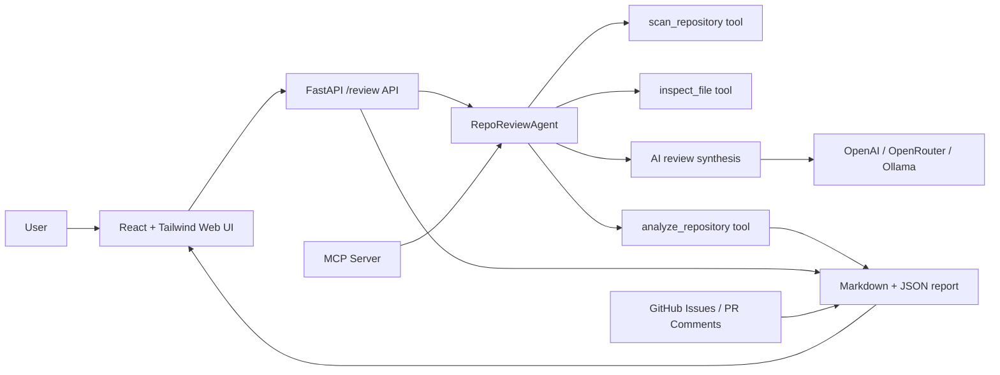

# GitHub Repo Review Agent

[](https://github.com/Zhejian-Zheng/GitHub-Repo-Review-Agent/actions/workflows/ci.yml)
[](https://zhejian-zheng.github.io/GitHub-Repo-Review-Agent/)


Put in a repository. Get back a structured engineering review.

GitHub Repo Review Agent is a lightweight developer tool that turns a local repository or public GitHub URL into an architecture summary, project health report, and actionable issue backlog. It combines deterministic repository analysis with an optional AI synthesis layer, so the core review still works without an LLM API key.

The product is designed for portfolio reviews, project handoffs, technical due diligence, and fast first-pass audits of unfamiliar codebases.

## At a Glance

| Area | What is included |
| --- | --- |
| Review engine | Deterministic repository scanner, analyzer rules, health score, finding fingerprints, and Markdown/JSON renderers. |
| Web app | React + Vite UI with login/register, guest demo mode, async review jobs, project history, run details, and report export. |
| Backend | FastAPI endpoints for live reviews, persistent job polling, Supabase Auth verification, CORS, rate limiting, and public demo controls. |
| Persistence | Supabase/Postgres schema for repositories, review runs, findings, AI reviews, and durable `review_jobs` state. |
| AI options | Optional OpenAI, OpenRouter, or local Ollama synthesis; deterministic review still works without an LLM key. |
| Automation | GitHub Actions CI, GitHub Pages demo deploy, Render backend blueprint, Docker support, PR bot, GitHub issue drafts, and MCP server. |
| Safety | Row-level security, per-user history ownership, service-role-only history writes, GitHub-only public target policy, and secret scanning heuristics. |

## Live Demo

- Frontend: [GitHub Pages demo](https://zhejian-zheng.github.io/GitHub-Repo-Review-Agent/)
- Demo mode: use `Continue as guest`, then click `Demo` to render the built-in sample report without a backend account.
- Live analysis: deploy the Render backend from [`render.yaml`](render.yaml), add the GitHub Pages repository variables, and sign in with Supabase email/password.
- Setup guide: [Hosted Demo: Render + GitHub Pages](docs/hosted-demo.md)

## Product Snapshot

- **Input**: local repository path or public GitHub repository URL.
- **Output**: Markdown report, structured JSON, optional GitHub issue drafts, and optional PR comment.
- **Review depth**: source structure, dependency manifests, tests, CI, docs, Docker hardening, secret-like values, framework signals, and evidence file paths.
- **AI layer**: optional OpenAI, OpenRouter, or local Ollama synthesis with stable JSON sections, prompt-tuning rules, and few-shot examples.
- **Interfaces**: CLI, React web UI, FastAPI endpoint, Docker workflow, GitHub integration, and MCP server.

## Product Capabilities

- Scans local repositories or public GitHub URLs.
- Detects source languages, dependency manifests, test files, docs, CI workflows, and common framework signals.
- Flags project hygiene risks with evidence file paths, including missing tests, shallow test breadth, missing CI, weak CI checks, missing lockfiles, incomplete README guidance, Docker runtime hardening gaps, and possible hard-coded secrets.
- Flags reproducibility and workflow risks such as floating dependency versions, unpinned Docker base images, and overly broad GitHub Actions write permissions.
- Generates a Markdown review report and optional JSON output.
- Can persist review history to Supabase/Postgres and classify findings as new, existing, or resolved across runs.
- Supports Supabase email/password login for the web UI, with authenticated review history saved per user.
- Provides a signed-in project detail view with latest score, top risks, AI summary, issue backlog, run history, and score trends.
- Supports English and Simplified Chinese report output.
- Includes a custom `RepoReviewAgent` that uses a traceable tool-calling loop.
- Includes an OpenAI Responses API function-calling agent where the model calls repository tools.
- Adds an optional AI review section through OpenAI, OpenRouter, or local Ollama.
- Keeps AI synthesis evidence-bound with shared prompt-tuning guidance and few-shot JSON examples.
- Creates GitHub issue drafts, can create GitHub issues, and can post pull request comments.
- Includes a GitHub Actions PR bot that compares PRs against the base branch, comments on new risks, scans `main` on a schedule, and blocks CI on high-severity findings.
- Provides optional Docker, FastAPI, and MCP server entry points.
- Includes production deployment examples for Docker Compose, Nginx, HTTPS, and public demo controls.
- Includes unit tests and a GitHub Actions workflow.

## What the Report Gives You

- **Executive summary**: a quick read on the repository's primary language, dependency surface, tests, CI, and framework signals.
- **Architecture signals**: detected frameworks and tooling with file-backed evidence.
- **Findings**: prioritized risks with severity, category, evidence text, evidence file paths, and concrete recommendations.
- **Agent trace**: visible tool-calling steps for agent runs, including scan, inspect, analyze, and AI synthesis stages.
- **AI review**: optional structured sections for architecture summary, top risks, project highlights, and next steps.
- **Issue backlog**: ready-to-use issue suggestions for actionable findings.

## How It Works

1. The scanner maps files, languages, dependency manifests, docs, tests, CI files, and operational config.
2. The analyzer applies deterministic review rules and attaches evidence file paths to every finding.
3. The agent can inspect key files and preserve a trace of its tool calls.
4. The optional AI layer receives the structured scan result and returns stable JSON sections.
5. The renderer produces Markdown, JSON, web UI cards, GitHub issue drafts, and MCP responses.

## Architecture



The web UI includes a static demo mode, so the frontend can be shown on static hosting such as GitHub Pages even when the FastAPI backend is not deployed.

## Quick Start

```bash
git clone https://github.com/Zhejian-Zheng/GitHub-Repo-Review-Agent.git
cd GitHub-Repo-Review-Agent
python -m pip install -e .
```

Analyze the current repository:

```bash
repo-review . --output review-report.md --json review-report.json
```

Run without installing the package:

```bash
PYTHONPATH=src python -m repo_review_agent.cli . --output review-report.md
```

Run the custom agent loop:

```bash
PYTHONPATH=src python -m repo_review_agent.cli . --agent --output review-report.md --json review-report.json
```

The agent records each step in the generated report:

```text
Thought -> Action/tool -> Observation
scan_repository -> inspect_file -> analyze_repository -> finalize_report
```

Run the OpenAI function-calling agent:

```bash
export OPENAI_API_KEY="your_api_key_here"
PYTHONPATH=src python -m repo_review_agent.cli . --function-calling --output review-report.md
```

Run the ChatGPT API repository review agent:

```bash
export OPENAI_API_KEY="your_api_key_here"
repo-review . --chatgpt-agent --output review-report.md --json review-report.json
```

The ChatGPT agent uses the OpenAI Responses API with repository tools. The model can ask the app to scan the repository, inspect important files, run deterministic analysis, and render a report preview before returning the final structured AI review. Keep `OPENAI_API_KEY` in your environment or deployment secrets; do not commit it to the repository.

Analyze another local repository:

```bash
repo-review ../some-project --output review-report.md
```

Analyze a GitHub repository:

```bash
repo-review https://github.com/owner/repo --output review-report.md
```

Generate a Simplified Chinese report:

```bash
repo-review . --agent --report-language zh-CN --output review-report.zh.md
```

Save review history to Supabase:

1. Open your Supabase SQL Editor and run [`supabase/schema.sql`](supabase/schema.sql).
   If you created the project with an earlier version of this schema, run it again or run the migrations in [`supabase/migrations`](supabase/migrations), including [`002_repository_ownership_hardening.sql`](supabase/migrations/002_repository_ownership_hardening.sql) and [`003_review_jobs.sql`](supabase/migrations/003_review_jobs.sql). These upgrades add per-user repository isolation, cascade owner cleanup, project-list indexes, and the persistent `review_jobs` table used by the hosted web API.
2. Run [`supabase/verify_history_schema.sql`](supabase/verify_history_schema.sql) in the SQL Editor. Every row should return `status = pass`.
3. Set server-side environment variables:

```bash
export SUPABASE_URL="https://your-project.supabase.co"
export SUPABASE_ANON_KEY="your_public_anon_key"
export SUPABASE_SERVICE_ROLE_KEY="your_service_role_key"
```

4. Run a scan with history persistence:

```bash
repo-review https://github.com/owner/repo --save-history --output review-report.md
```

The history store saves repositories, review runs, findings, AI review sections, health score, and a diff against the previous run. Signed-in users get separate history rows even when they scan the same repository URL. The service role key must stay in trusted CLI/server environments; do not expose it in browser code.

Enable Supabase login in the web UI:

In Supabase Auth settings, keep Email provider enabled and add your local or deployed frontend URL to the allowed redirect URLs.

```bash
export VITE_SUPABASE_URL="https://your-project.supabase.co"
export VITE_SUPABASE_ANON_KEY="your_public_anon_key"
export SUPABASE_URL="https://your-project.supabase.co"
export SUPABASE_ANON_KEY="your_public_anon_key"
export SUPABASE_SERVICE_ROLE_KEY="your_service_role_key"
```

Check whether the demo environment is ready:

```bash
repo-review-demo-check
```

Build and run the web app:

```bash
cd frontend
npm run build
cd ..
repo-review-web
```

When a user signs in, the frontend sends their Supabase access token to the FastAPI backend. The frontend refreshes expiring sessions before loading history or saving a review, and the backend verifies the token with Supabase Auth before saving review history with the authenticated `owner_id`. The web UI also has a guest mode for browsing the app and loading the built-in demo report. Set `REPO_REVIEW_REQUIRE_AUTH=true` when you want the web API to reject unauthenticated live review requests.

The web UI submits scans through an asynchronous job API:

- `POST /review/jobs` creates a review job and returns a `job_id`.
- `GET /review/jobs/{job_id}` returns `queued`, `running`, `completed`, or `failed`, plus the final report when complete.
- `REPO_REVIEW_JOB_STORE=supabase` persists job state and results to Supabase `review_jobs`; `memory` keeps the lightweight local-only store.
- `REPO_REVIEW_JOB_WORKERS` controls the number of background worker threads. The default is `2`.

The original synchronous `POST /review` endpoint is still available for scripts and compatibility.

After signing in and saving at least one review, the web UI shows a project detail workspace for each repository. It includes the latest health score, new/existing/resolved finding counts, top risks, AI summary, issue backlog, historical runs, and a compact score trend.

Repository history is read through backend APIs instead of direct browser-to-Supabase queries:

- `GET /history/repositories`
- `GET /history/repositories/{repository_id}`

These endpoints verify the Supabase access token, use the server-side service role key, and apply the authenticated user's `owner_id` before returning history rows.

For a full browser demo checklist, see [`docs/demo-runbook.md`](docs/demo-runbook.md).

Preview GitHub issues from findings:

```bash
repo-review https://github.com/owner/repo --agent --github-issues dry-run
```

Create GitHub issues:

```bash
export GITHUB_TOKEN="your_github_token"
repo-review https://github.com/owner/repo --agent --github-issues create
```

Preview a pull request comment:

```bash
repo-review https://github.com/owner/repo --agent --github-pr-comment 12
```

Post or update a pull request comment:

```bash
export GITHUB_TOKEN="your_github_token"
repo-review https://github.com/owner/repo --agent --github-pr-comment 12 --github-pr-comment-mode upsert
```

Run the PR bot locally against two generated reports:

```bash
repo-review ../base-checkout --json baseline-report.json --output baseline-report.md
repo-review . --json review-report.json --output review-report.md
repo-review-pr-bot \
  --report-json review-report.json \
  --baseline-json baseline-report.json \
  --comment-mode dry-run \
  --fail-on-severity high
```

The `.github/workflows/repo-review-bot.yml` workflow runs this automatically. On pull requests it reviews the PR head against the base branch, updates one sticky review comment with newly introduced findings when the PR comes from the same repository, and fails CI when a new high-severity finding appears. On scheduled `main` scans it fails when any high-severity finding exists.

To post or update the PR bot comment locally:

```bash
export GITHUB_TOKEN="your_github_token"
repo-review-pr-bot \
  --report-json review-report.json \
  --baseline-json baseline-report.json \
  --github-repo owner/repo \
  --pr-number 12 \
  --comment-mode upsert \
  --fail-on-severity high
```

Enable the OpenAI AI layer:

```bash
export OPENAI_API_KEY="your_api_key_here"
repo-review . --ai-provider openai --output review-report.md
```

Run the custom agent with OpenAI synthesis:

```bash
repo-review . --agent --ai-provider openai --output review-report.md
```

Use a specific OpenAI model:

```bash
repo-review . --ai-provider openai --ai-model gpt-5-mini --output review-report.md
```

Enable OpenRouter:

```bash
export OPENROUTER_API_KEY="your_openrouter_key"
repo-review . --ai-provider openrouter --ai-model openrouter/auto --output review-report.md
```

Enable the local Ollama AI layer:

```bash
ollama pull llama3.2
repo-review . --ai-provider ollama --ai-model llama3.2 --output review-report.md
```

By default, AI provider errors are written into the report instead of failing the whole scan. Use `--fail-on-ai-error` when you want CI or automation to stop on model failures.

## Docker

Build and run the CLI against the current repository:

```bash
docker build -t repo-review-agent .
docker run --rm -v "$PWD:/workspace:ro" -v "$PWD/reports:/reports" repo-review-agent /workspace --agent --output /reports/review-report.md
```

Run the default compose review job:

```bash
docker compose up --build repo-review
```

Run the web UI:

```bash
docker compose --profile web up --build web
```

Then open `http://localhost:8000` and enter `/workspace` as the target when using Docker Compose.

Run the production-style web service locally:

```bash
cp .env.example .env
docker compose -f docker-compose.prod.yml up -d --build web
```

For VPS deployment with Nginx and HTTPS, see [Deployment Guide](docs/deployment.md).

## Web API

Install optional web dependencies:

```bash
python -m pip install -e ".[web]"
repo-review-web
```

The web UI is built with React, Vite, and Tailwind CSS. It lets users enter a GitHub repository URL, choose the report language, generate a Markdown report, then copy, download, or close the generated report.

For static hosting demos, use the `Demo` button in the frontend. It renders a built-in sample report without calling the backend, which is useful for GitHub Pages or portfolio previews.

## GitHub Pages Static Demo

This repository includes a GitHub Pages workflow that deploys the React frontend as a portfolio demo. The frontend can show the built-in sample report through `Demo`, and it can run live repository analysis when `VITE_API_BASE_URL` points at the deployed FastAPI backend.

To enable it:

1. Push the repository to GitHub.
2. Open `Settings -> Pages`.
3. Set the source to `GitHub Actions`.
4. Add repository variables under `Settings -> Secrets and variables -> Actions -> Variables`:

```text
REPO_REVIEW_API_BASE_URL=https://github-repo-review-agent-api.onrender.com
VITE_SUPABASE_URL=https://your-project.supabase.co
VITE_SUPABASE_ANON_KEY=your_public_anon_key
```

5. Run the `GitHub Pages Demo` workflow or push to `main`.

The workflow builds `frontend/dist` with the correct GitHub Pages base path and injects the public frontend configuration. For the full hosted setup, including Render and Supabase Auth redirect URLs, see [Hosted Demo](docs/hosted-demo.md).

Run the React frontend in development mode:

```bash
repo-review-web
cd frontend
npm install
npm run dev
```

Then open `http://localhost:5173`. Vite proxies `/review` to the FastAPI backend on `http://localhost:8000`. For split hosting, set `VITE_API_BASE_URL` to the deployed backend URL.

Build the React frontend and serve it from FastAPI:

```bash
cd frontend
npm install
npm run build
cd ..
repo-review-web
```

Then open `http://localhost:8000`.

Review through the HTTP API:

```bash
export REPO_REVIEW_ALLOW_LOCAL_TARGETS=true
curl -X POST http://localhost:8000/review \
  -H "Content-Type: application/json" \
  -d '{"target": ".", "mode": "agent", "ai_provider": "openrouter", "ai_model": "openrouter/auto", "report_language": "zh-CN"}'
```

For public demos, keep `REPO_REVIEW_ALLOW_LOCAL_TARGETS=false`, set `REPO_REVIEW_REQUIRE_AUTH=true`, configure `REPO_REVIEW_CORS_ORIGINS` with the frontend origin, and set `REPO_REVIEW_RATE_LIMIT_PER_MINUTE=30` or lower so visitors can only review GitHub URLs and cannot spam the endpoint.

## MCP Server

Install optional MCP dependencies:

```bash
python -m pip install -e ".[mcp]"
repo-review-mcp
```

The MCP server exposes:

- `review_repository`
- `generate_issue_backlog`
- `summarize_architecture`

Run tests:

```bash
python -m unittest discover -s tests
```

Run coverage:

```bash
coverage run -m unittest discover -s tests
coverage report
```

The test suite includes evaluation fixtures and golden report snapshots under `tests/fixtures/`. These lock in expected findings, forbidden false positives, framework signals, and rendered Markdown for representative repositories.

## Product Demo

Generated report examples:

- [Agent report](docs/example-report.md)
- [AI demo report with Ollama](docs/ai-demo-report.md)

Each generated report includes:

- Executive summary
- Repository metrics
- Framework and tooling signals
- Agent Trace for tool-calling runs
- Optional AI Review output
- Findings with severity, evidence, evidence file paths, and recommendations
- GitHub issue backlog suggestions

The static frontend demo can be deployed to GitHub Pages and still show the full reporting experience through the built-in sample report. Live repository analysis requires the FastAPI backend.

## Project Structure

```text
src/repo_review_agent/
  agent.py      # Custom tool-calling agent orchestration layer
  analyzer.py   # Rule-based review logic
  cli.py        # Command-line interface
  function_agent.py # OpenAI function-calling agent
  github.py     # GitHub issues and PR comments
  i18n.py       # English and Simplified Chinese report localization
  llm.py        # Optional OpenAI, OpenRouter, and Ollama AI review layer
  mcp_server.py # MCP tools for AI coding assistants
  models.py     # Structured report data models
  report.py     # Markdown and JSON report rendering
  security.py   # Public web API safety controls
  scanner.py    # Repository scanning and file classification
  web.py        # FastAPI app and React static asset serving
tests/          # Unit tests
.github/        # CI workflow
deploy/         # Nginx and deployment examples
frontend/       # React + Tailwind CSS frontend
```

## Project Highlights

- **Offline-first review core**: the scanner and deterministic analyzer work without an API key, so the product can still generate useful reports in local, CI, or restricted environments.
- **Evidence-backed findings**: each finding includes evidence text and relevant file paths, making the report easier to verify and turn into engineering tasks.
- **Traceable agent workflow**: agent runs expose their tool calls, so users can see how the review moved from scan to inspection to final report.
- **Flexible AI synthesis**: OpenAI, OpenRouter, and Ollama can be used to add richer architecture and risk summaries without changing the deterministic review contract.
- **Multiple delivery surfaces**: the same report model powers the CLI, web UI, GitHub issue generation, PR comments, MCP tools, and API responses.

## Product Positioning

Short description:

```text
GitHub Repo Review Agent helps developers understand an unfamiliar repository quickly by combining file-backed static analysis, traceable agent steps, and optional AI synthesis into one shareable review report.
```

Strong use cases:

- Reviewing a project before a handoff or onboarding session.
- Creating a quick portfolio-quality explanation of what a repository does.
- Turning repository hygiene gaps into GitHub issue drafts.
- Comparing project readiness across tests, CI, docs, dependencies, and deployment signals.
- Giving AI coding assistants a structured repository review tool through MCP.

## Roadmap

- Add GitHub Actions PR annotation mode.
- Add richer repository dependency vulnerability checks.
- Add screenshots of the web UI and sample report.

## License

This project is licensed under the MIT License.
