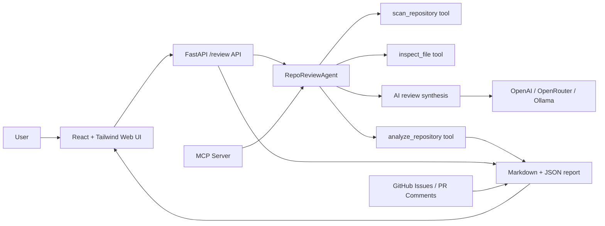

# GitHub Repo Review Agent

A lightweight repository review agent that analyzes project structure, dependency files, source code, tests, CI configuration, and security hygiene to generate architecture summaries, risk reports, and actionable GitHub issue suggestions.

The MVP is intentionally small and reproducible: it runs without an LLM API key, produces structured JSON, and renders a Markdown report. When enabled, the optional AI layer asks providers for structured JSON sections, then renders them into a stable architecture summary, risk explanation, project highlights, and next-step plan.

## Features

- Scans local repositories or public GitHub URLs.
- Detects source languages, dependency manifests, test files, docs, CI workflows, and common framework signals.
- Flags project hygiene risks such as missing tests, shallow test breadth, missing CI, weak CI checks, missing lockfiles, incomplete README guidance, Docker runtime hardening gaps, and possible hard-coded secrets.
- Generates a Markdown review report and optional JSON output.
- Supports English and Simplified Chinese report output.
- Includes a custom `RepoReviewAgent` that uses a traceable tool-calling loop.
- Includes an OpenAI Responses API function-calling agent where the model calls repository tools.
- Adds an optional AI review section through OpenAI, OpenRouter, or local Ollama.
- Creates GitHub issue drafts, can create GitHub issues, and can post pull request comments.
- Provides optional Docker, FastAPI, and MCP server entry points.
- Includes production deployment examples for Docker Compose, Nginx, HTTPS, and public demo controls.
- Includes unit tests and a GitHub Actions workflow.

## Architecture



The web UI also includes a static demo mode, so the frontend can be shown on static hosting such as GitHub Pages even when the FastAPI backend is not deployed.

## Quick Start

```bash
git clone https://github.com/<your-username>/GitHub-Repo-Review-Agent.git
cd GitHub-Repo-Review-Agent
python -m pip install -e .
```

Analyze the current repository:

```bash
repo-review . --output review-report.md --json review-report.json
```

Run without installing the package:

```bash
PYTHONPATH=src python -m repo_review_agent.cli . --output review-report.md
```

Run the custom agent loop:

```bash
PYTHONPATH=src python -m repo_review_agent.cli . --agent --output review-report.md --json review-report.json
```

The agent records each step in the generated report:

```text
Thought -> Action/tool -> Observation
scan_repository -> inspect_file -> analyze_repository -> finalize_report
```

Run the OpenAI function-calling agent:

```bash
export OPENAI_API_KEY="your_api_key_here"
PYTHONPATH=src python -m repo_review_agent.cli . --function-calling --output review-report.md
```

Analyze another local repository:

```bash
repo-review ../some-project --output review-report.md
```

Analyze a GitHub repository:

```bash
repo-review https://github.com/owner/repo --output review-report.md
```

Generate a Simplified Chinese report:

```bash
repo-review . --agent --report-language zh-CN --output review-report.zh.md
```

Preview GitHub issues from findings:

```bash
repo-review https://github.com/owner/repo --agent --github-issues dry-run
```

Create GitHub issues:

```bash
export GITHUB_TOKEN="your_github_token"
repo-review https://github.com/owner/repo --agent --github-issues create
```

Preview a pull request comment:

```bash
repo-review https://github.com/owner/repo --agent --github-pr-comment 12
```

Post a pull request comment:

```bash
export GITHUB_TOKEN="your_github_token"
repo-review https://github.com/owner/repo --agent --github-pr-comment 12 --github-pr-comment-mode create
```

Enable the OpenAI AI layer:

```bash
export OPENAI_API_KEY="your_api_key_here"
repo-review . --ai-provider openai --output review-report.md
```

Run the custom agent with OpenAI synthesis:

```bash
repo-review . --agent --ai-provider openai --output review-report.md
```

Use a specific OpenAI model:

```bash
repo-review . --ai-provider openai --ai-model gpt-5-mini --output review-report.md
```

Enable OpenRouter:

```bash
export OPENROUTER_API_KEY="your_openrouter_key"
repo-review . --ai-provider openrouter --ai-model openrouter/auto --output review-report.md
```

Enable the local Ollama AI layer:

```bash
ollama pull llama3.2
repo-review . --ai-provider ollama --ai-model llama3.2 --output review-report.md
```

By default, AI provider errors are written into the report instead of failing the whole scan. Use `--fail-on-ai-error` when you want CI or automation to stop on model failures.

## Docker

Build and run the CLI against the current repository:

```bash
docker build -t repo-review-agent .
docker run --rm -v "$PWD:/workspace:ro" -v "$PWD/reports:/reports" repo-review-agent /workspace --agent --output /reports/review-report.md
```

Run the default compose review job:

```bash
docker compose up --build repo-review
```

Run the web UI:

```bash
docker compose --profile web up --build web
```

Then open `http://localhost:8000` and enter `/workspace` as the target when using Docker Compose.

Run the production-style web service locally:

```bash
cp .env.example .env
docker compose -f docker-compose.prod.yml up -d --build web
```

For VPS deployment with Nginx and HTTPS, see [Deployment Guide](docs/deployment.md).

## Web API

Install optional web dependencies:

```bash
python -m pip install -e ".[web]"
repo-review-web
```

The web UI is built with React, Vite, and Tailwind CSS. It lets users enter a GitHub repository URL, choose the report language, generate a Markdown report, then copy, download, or close the generated report.

For static hosting demos, use the `Load Demo` button in the frontend. It renders a built-in sample report without calling the backend, which is useful for GitHub Pages or portfolio previews.

## GitHub Pages Static Demo

This repository includes a GitHub Pages workflow that deploys the React frontend as a static portfolio demo. The static demo can show the built-in sample report through `Load Demo`, but live repository analysis still requires the FastAPI backend.

To enable it:

1. Push the repository to GitHub.
2. Open `Settings -> Pages`.
3. Set the source to `GitHub Actions`.
4. Run the `GitHub Pages Demo` workflow or push to `main`.

The workflow builds `frontend/dist` with the correct GitHub Pages base path.

Run the React frontend in development mode:

```bash
repo-review-web
cd frontend
npm install
npm run dev
```

Then open `http://localhost:5173`. Vite proxies `/review` to the FastAPI backend on `http://localhost:8000`.

Build the React frontend and serve it from FastAPI:

```bash
cd frontend
npm install
npm run build
cd ..
repo-review-web
```

Then open `http://localhost:8000`.

Review through the HTTP API:

```bash
curl -X POST http://localhost:8000/review \
  -H "Content-Type: application/json" \
  -d '{"target": ".", "mode": "agent", "ai_provider": "openrouter", "ai_model": "openrouter/auto", "report_language": "zh-CN"}'
```

For public demos, set `REPO_REVIEW_ALLOW_LOCAL_TARGETS=false` and `REPO_REVIEW_RATE_LIMIT_PER_MINUTE=10` so visitors can only review GitHub URLs and cannot spam the endpoint.

## MCP Server

Install optional MCP dependencies:

```bash
python -m pip install -e ".[mcp]"
repo-review-mcp
```

The MCP server exposes:

- `review_repository`
- `generate_issue_backlog`
- `summarize_architecture`

Run tests:

```bash
python -m unittest discover -s tests
```

## Example Output

Generated examples:

- [Agent report](docs/example-report.md)
- [AI demo report with Ollama](docs/ai-demo-report.md)

The generated report includes:

- Executive summary
- Repository metrics
- Framework and tooling signals
- Agent Trace for tool-calling runs
- Optional AI Review output
- Findings with severity, evidence, and recommendations
- GitHub issue backlog suggestions

## Project Structure

```text
src/repo_review_agent/
  agent.py      # Custom tool-calling agent orchestration layer
  analyzer.py   # Rule-based review logic
  cli.py        # Command-line interface
  function_agent.py # OpenAI function-calling agent
  github.py     # GitHub issues and PR comments
  i18n.py       # English and Simplified Chinese report localization
  llm.py        # Optional OpenAI, OpenRouter, and Ollama AI review layer
  mcp_server.py # MCP tools for AI coding assistants
  models.py     # Structured report data models
  report.py     # Markdown and JSON report rendering
  security.py   # Public web API safety controls
  scanner.py    # Repository scanning and file classification
  web.py        # FastAPI app and React static asset serving
tests/          # Unit tests
.github/        # CI workflow
deploy/         # Nginx and deployment examples
frontend/       # React + Tailwind CSS frontend
```

## Resume Talking Points

- Built a lightweight code review agent with structured outputs and deterministic analysis.
- Implemented a custom tool-calling agent loop and an OpenAI function-calling agent for repository scanning, file inspection, risk classification, report generation, and optional LLM-based review synthesis.
- Added security checks for secret-like values and project hygiene checks for tests, CI, dependency manifests, and licensing.
- Integrated GitHub issue dry-runs, issue creation, PR comments, Docker, FastAPI, and MCP tools while keeping the base CLI offline-friendly.

## Interview Pitch

Short version:

```text
I built a full-stack AI repository review agent. It scans a GitHub repository, runs deterministic project hygiene and security checks, lets an agent call tools such as scan_repository and inspect_file, optionally asks an LLM to synthesize the review, and returns a Markdown/JSON report through a React + FastAPI web app.
```

Resume bullets:

- Built a full-stack AI developer tool with React, Tailwind CSS, FastAPI, Docker, and GitHub Actions.
- Implemented a traceable custom Agent loop and an OpenAI Function Calling agent for repository scanning, file inspection, risk analysis, and report generation.
- Integrated OpenAI, OpenRouter, and local Ollama providers behind a lightweight provider layer with multilingual report generation.
- Exposed repository review workflows as MCP tools for AI coding assistant integration.
- Added production-minded controls including rate limiting, GitHub-only public demo mode, Docker Compose deployment, and Nginx HTTPS examples.

## Roadmap

- Add GitHub Actions PR annotation mode.
- Add richer repository dependency vulnerability checks.
- Add screenshots of the web UI and sample report.

## License

This project is licensed under the MIT License.
